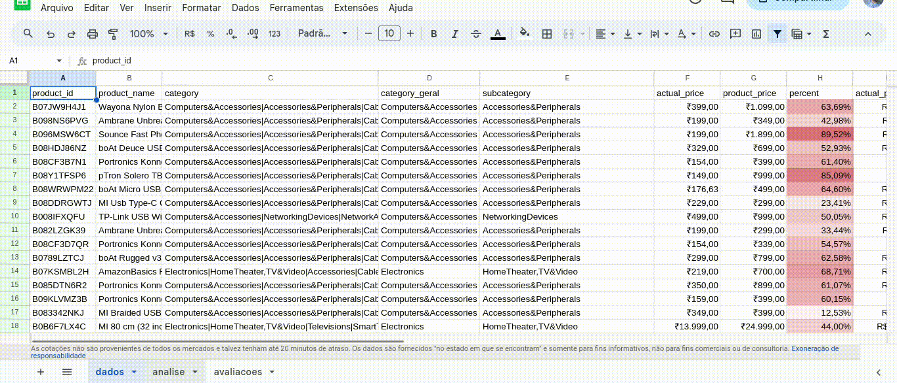

# Imersão Dados: Análises com Inteligência Artificial

As análises e visualizações foram desenvolvidas durante uma intensa semana de aprendizado sobre análises de dados utilizando ferramentas de Inteligência Artificial, como o [ChatGPT](https://chat.openai.com). As aulas foram promovidas pela plataforma [Alura](https://www.alura.com.br/) e a partir delas foi possível tirar insights interessantes de bases de dados já existentes, retiradas do [Kaggle](https://www.kaggle.com/).

## Técnicas e tecnologias utilizadas

### Google Sheets

- Análise exploratória dos dados;
- Uso de fórmulas simples e avançadas (cálculo de média para categorias de valores e média ponderada);
- Visualização de dados com gráficos;
- Traduções, resumos e análises de sentimento através da extensão do ChatGPT dentro do Google Sheets (`SheetGPT`);
- Base de dados: [Amazon](https://www.kaggle.com/datasets/karkavelrajaj/amazon-sales-dataset), [IMDB Movies](https://www.kaggle.com/datasets/harshitshankhdhar/imdb-dataset-of-top-1000-movies-and-tv-shows), [Hotels](https://www.kaggle.com/datasets/andrewgeorgeissac/hotels-in-munnar-kerala), [Threads](https://www.kaggle.com/datasets/saloni1712/threads-an-instagram-app-reviews)

### Python

- Utilização do `Google Colab`;
- Análise exploratória e limpeza dos dados com a biblioteca `pandas`;
- Visualização de dados com gráficos feitos nas bibliotecas `seaborn`e `plotly` (responsável pela interatividade do gráfico);
- Uso da biblioteca `Pandas Profiling`;
- Base de dados: [Amazon](https://www.kaggle.com/datasets/karkavelrajaj/amazon-sales-dataset), [Hotels](https://www.kaggle.com/datasets/andrewgeorgeissac/hotels-in-munnar-kerala)

### Software R

- Análise exploratória e limpeza dos dados com o conjunto de pacotes `tidyverse`;
- Visualização de dados com gráficos através dos pacotes `ggplot2` e `plotly`;
- Base de dados: [IMDB Movies](https://www.kaggle.com/datasets/harshitshankhdhar/imdb-dataset-of-top-1000-movies-and-tv-shows)

## Apêndice

Para abrir e rodar os gráficos é necessário baixá-los em sua máquina.